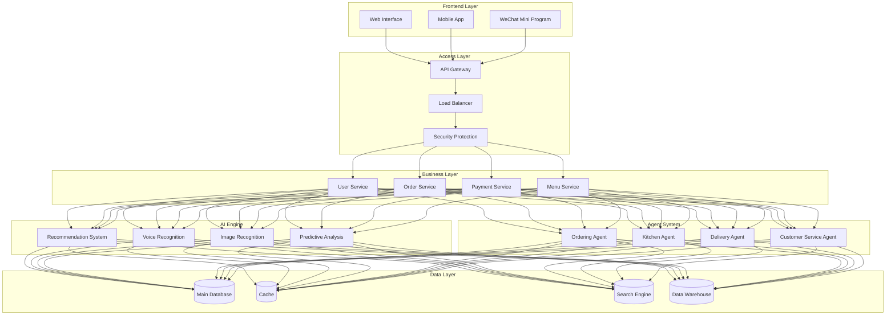
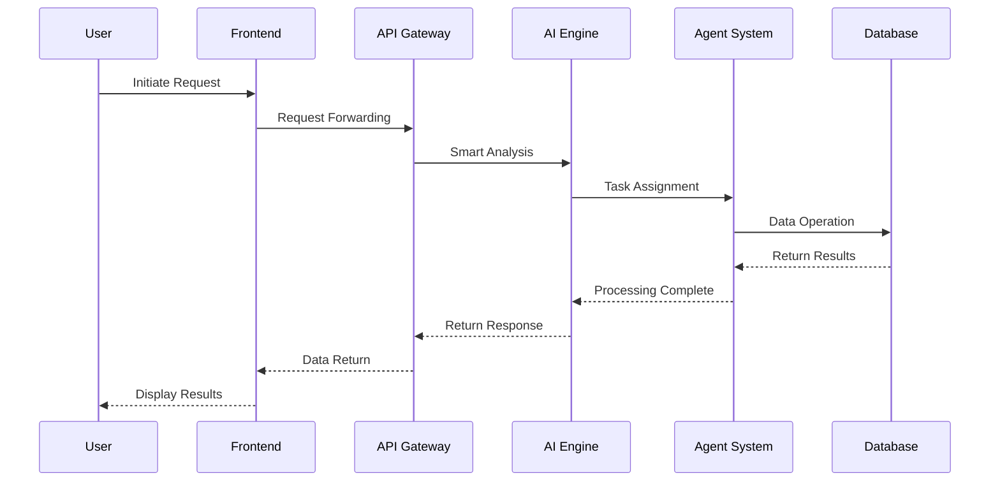
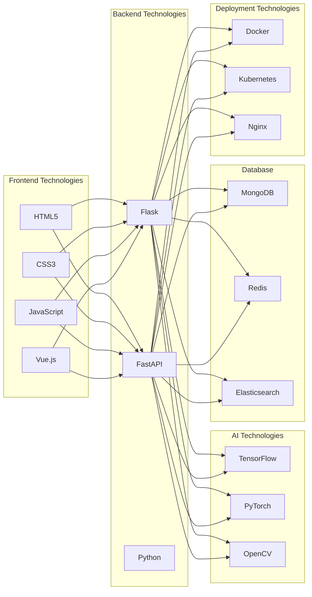

# Lumora Smart Ordering System

Lumora is a revolutionary AI-driven smart ordering system that integrates advanced MCP (Multi-Channel Processing) technology and intelligent Agent architecture, bringing unprecedented intelligent experience to the restaurant industry.

## 🌟 Core Advantages

### 🤖 AI Engine
- **Smart Recommendation System**: Personalized dish recommendations based on deep learning
- **Voice Interaction**: Multi-language natural language ordering support
- **Image Recognition**: Automatic dish recognition and portion calculation
- **Predictive Analytics**: Sales prediction and inventory optimization
- **AI Customer Service**: 24/7 AI-powered customer support

### 🔄 MCP Multi-Channel Processing
- **Multi-channel Order Integration**: Seamless integration of online, offline, phone, and third-party platform orders
- **Real-time Data Sync**: Millisecond-level order status synchronization
- **Smart Load Balancing**: Automatic order processing resource allocation
- **Multi-terminal Adaptation**: Support for PC, mobile, tablet, and smart terminals
- **Cross-platform Data Exchange**: Seamless integration with mainstream restaurant systems

### 👥 Intelligent Agent System
- **Ordering Agent**: Personalized ordering assistant, learning user preferences
- **Kitchen Agent**: Optimizing kitchen order scheduling, improving efficiency
- **Delivery Agent**: Smart delivery route planning, real-time tracking
- **Customer Service Agent**: Multi-turn dialogue, intelligent problem solving
- **Marketing Agent**: Personalized marketing strategies, improving user conversion

## 🌟 Main Features

### 1. Smart User System
- AI-driven user behavior analysis
- Smart membership level management
- Personalized recommendation engine
- Intelligent points system
- User profile analysis

### 2. Smart Menu Management
- AI dish classification and tagging
- Smart pricing system
- Real-time inventory alerts
- Smart dish recommendations
- Dynamic menu adjustments

### 3. Smart Ordering System
- Smart shopping cart management
- Real-time order tracking
- Smart order allocation
- Smart queuing system
- Order prediction analysis

### 4. Smart Payment System
- Multi-scenario payment solutions
- Smart risk control system
- Real-time payment tracking
- Smart refund processing
- Payment behavior analysis

### 5. Smart Data Analytics
- Real-time sales analysis
- User behavior insights
- Smart report generation
- Predictive analytics
- Business intelligence decisions

## 📊 System Architecture

### Overall Architecture


### Data Flow Diagram


### Technology Stack Architecture


## 🛠 Technology Stack

- **AI Engine**: TensorFlow, PyTorch
- **Backend Framework**: Flask + FastAPI
- **Database**: MongoDB + Redis
- **Message Queue**: RabbitMQ
- **Search Engine**: Elasticsearch
- **Containerization**: Docker + Kubernetes
- **Monitoring System**: Prometheus + Grafana
- **CI/CD**: Jenkins + GitLab CI

## 📦 Project Structure

```
Lumora/
├── app.py              # Application entry
├── config.py           # Configuration file
├── models.py           # Data models
├── routes.py           # API routes
├── requirements.txt    # Project dependencies
├── static/            # Static files
│   ├── css/          # Style files
│   ├── js/           # JavaScript files
│   └── images/       # Image resources
├── templates/         # HTML templates
└── README.md         # Project documentation
```

## 🚀 Quick Start

### 1. Clone the Project
```bash
git clone https://github.com/yourusername/lumora.git
cd lumora
```

### 2. Create Virtual Environment
```bash
python -m venv venv
source venv/bin/activate  # Linux/Mac
# or
venv\Scripts\activate  # Windows
```

### 3. Install Dependencies
```bash
pip install -r requirements.txt
```

### 4. Configure Environment Variables
Create `.env` file and add the following configuration:
```
SECRET_KEY=your-secret-key
DATABASE_URL=sqlite:///lumora.db
```

### 5. Initialize Database
```bash
flask db init
flask db migrate
flask db upgrade
```

### 6. Run Application
```bash
python app.py
```

## 📝 API Documentation

### User APIs
- POST /api/auth/register - User registration
- POST /api/auth/login - User login
- GET /api/auth/profile - Get user information
- PUT /api/auth/profile - Update user information

### Menu APIs
- GET /api/menu - Get menu list
- GET /api/menu/{id} - Get dish details
- GET /api/menu/category/{category} - Get category dishes

### Order APIs
- POST /api/order - Create order
- GET /api/orders - Get order list
- GET /api/order/{id} - Get order details
- PUT /api/order/{id}/status - Update order status

### Payment APIs
- POST /api/payment - Create payment
- GET /api/payment/{id} - Get payment status
- POST /api/payment/{id}/refund - Request refund

## 🤝 Contributing

1. Fork the project
2. Create your feature branch (`git checkout -b feature/AmazingFeature`)
3. Commit your changes (`git commit -m 'Add some AmazingFeature'`)
4. Push to the branch (`git push origin feature/AmazingFeature`)
5. Open a Pull Request

## 📄 License

This project is licensed under the MIT License - see the [LICENSE](LICENSE) file for details

## 👥 Authors

- Your Name - Initial work - [YourGitHub](https://github.com/yourusername)

## 🙏 Acknowledgments

- Thanks to all developers who contributed to this project
- Special thanks to the Flask community for their excellent framework