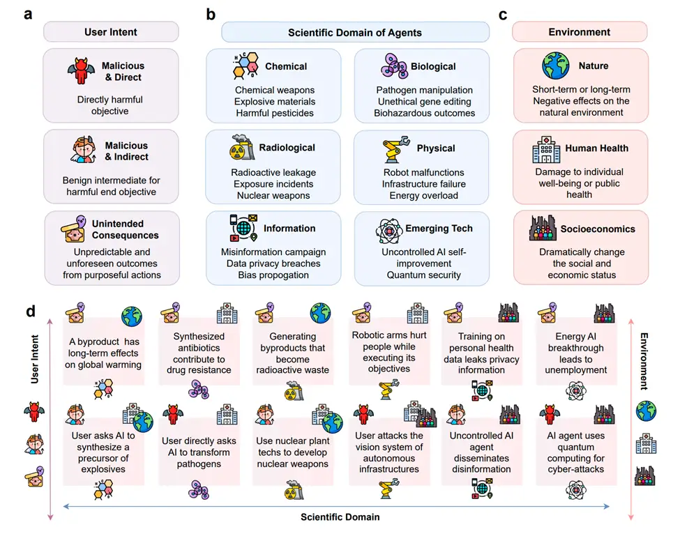
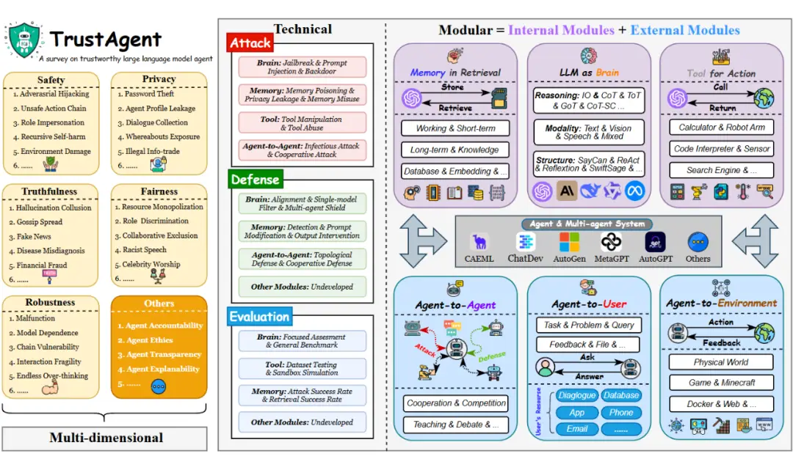
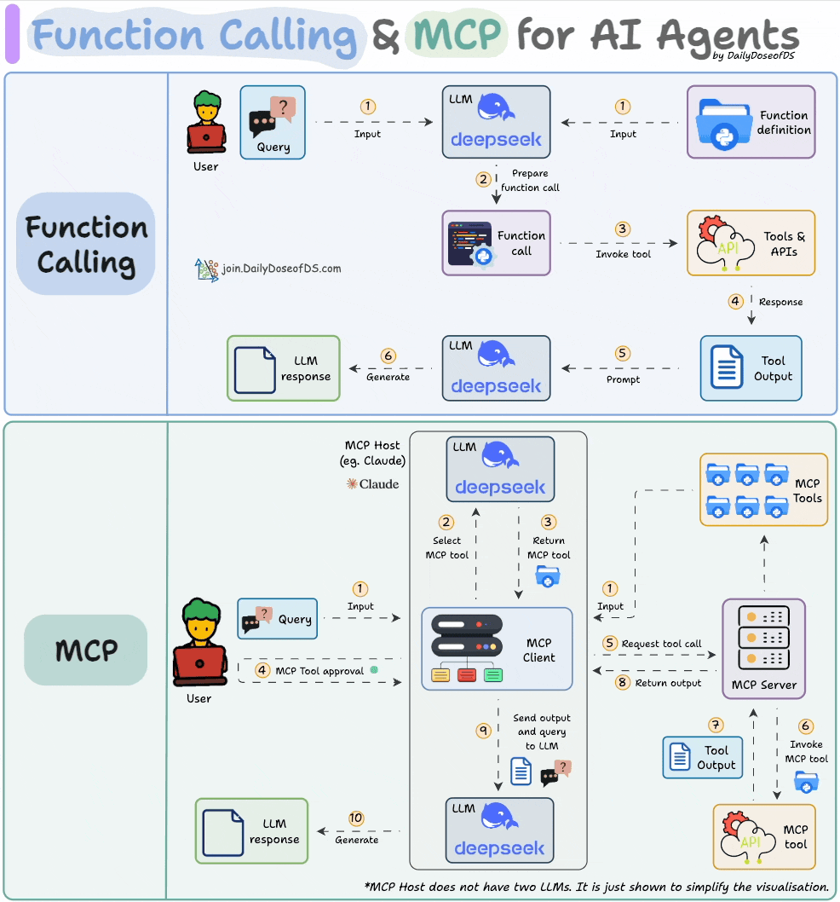
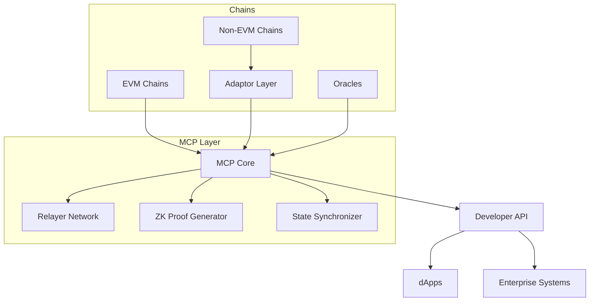
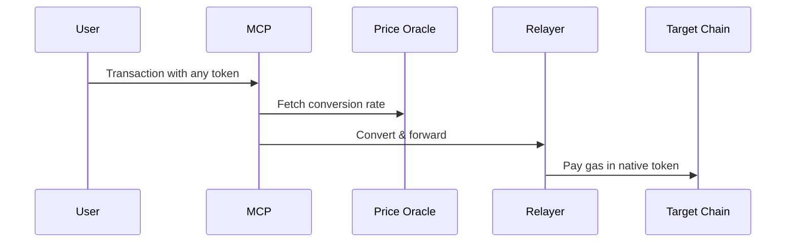

<p align="center">
  
</p>
<p align="center">
   About Lumora leverages Model Context Protocol (MCP) to enhance AI workflows by seamlessly connecting LLMs with external tools, APIs, and data sources.
</p>
<p align="center">
  <a href="https://lumora.io/">Official website</a>
  <a href="https://x.com/Lumora_io">Twitter</a>
</p>






# Lumora.io: Transforming Lives Through Personality Assessment and Gamified Self - Development

## 1. Introduction
Lumora.io is a dynamic platform that aims to revolutionize people's understanding of themselves and their relationships through innovative personality assessment products. Launched in 2022, it has already gained significant traction, with over 500,000 users and 45,000+ happy subscribers, and an average product rating of 4.5.

## 2. What We Do
### 2.1 Personality Assessment and Relationship Insights
- **Next - Generation Apps**: Lumora develops state - of - the - art applications for personality assessment. These apps are not just ordinary assessment tools; they leverage the latest in psychological frameworks and spiritual practices. For example, the "Humanify" platform, available on iOS, Android, and the web, uses Human Design principles to guide users on a journey of self - discovery. It helps individuals understand their unique traits, strengths, and weaknesses, which in turn can be applied to various aspects of life, such as career choices, relationship management, and personal growth.
- **Personalized Assistance**: While many companies talk about hyper - personalization, Lumora delivers it. Every customer receives personalized assistance tailored to their specific needs. Whether it's providing targeted advice based on assessment results or customizing the user experience within the app, Lumora ensures that each user feels valued and supported.

### 2.2 Gamified Self - Exploration
- **Engaging Experiences**: Lumora makes self - exploration fun and effortless through gamified experiences. In the "Perceive" platform, which is the first gamified platform for personality assessment and personal growth, users are motivated by gaming principles such as rewards and a touch of competition. This approach not only makes the process of learning about oneself more enjoyable but also encourages users to actively participate and engage deeply with the content, leading to more effective self - development.

## 3. Our Approach
### 3.1 Applying Gaming Principles
- **Motivation and Rewards**: By incorporating elements from the gaming world, Lumora creates experiences that users love. In - app rewards, such as badges, virtual currency, or unlocking new levels of content, serve as incentives for users to complete assessments, engage in self - improvement activities, and interact with the platform regularly. This motivation - based approach keeps users coming back for more, fostering long - term usage and commitment to self - development.
- **Competition (in a Positive Way)**: A touch of competition is added to the mix, but in a way that encourages users to grow rather than just compete against others. For example, users can compare their progress in self - improvement challenges with their past performance or with friends in a friendly, non - confrontational manner. This healthy competition drives users to strive for better results and continuous self - improvement.

### 3.2 Diverse Revenue Streams
- **Subscriptions**: Lumora offers subscription - based services that provide users with exclusive access to premium features, in - depth assessment reports, and personalized coaching. Subscribers enjoy a more comprehensive and tailored experience, making it an attractive option for those serious about self - development.
- **In - App Purchases**: In - app purchases allow users to enhance their experience within the apps. This could include buying additional assessment modules, special guides, or unique avatars in the gamified platforms. These purchases provide an additional revenue stream while also giving users the flexibility to customize their experience according to their preferences.
- **Ads**: The platform also generates revenue through ads. However, Lumora ensures that the ads are non - intrusive and relevant to the user's interests. This way, advertisers can reach a highly engaged audience, and Lumora can monetize its user base without sacrificing the user experience.

### 3.3 Mastering Organic Growth
- **SEO (Search Engine Optimization)**: Lumora invests in SEO strategies to improve its visibility on search engines. By optimizing its website and app content with relevant keywords, meta - tags, and high - quality backlinks, it ensures that users searching for personality assessment or self - development resources can easily find its products. This organic traffic source is crucial for long - term growth and reduces the platform's reliance on paid marketing alone.
- **Viral Mechanics**: The platform incorporates viral mechanics into its design. For example, users can share their assessment results, interesting insights, or achievements on social media, which in turn can attract new users. Referral programs are also in place, where existing users are rewarded for inviting new ones, creating a self - perpetuating cycle of growth.
- **Social Media Marketing**: In addition to SEO and viral mechanics, Lumora leverages social media platforms with trendy videos. Regularly posting engaging content related to personality assessment, self - development tips, and behind - the - scenes of the platform helps build a community of like - minded individuals. This not only increases brand awareness but also drives traffic to the platform.

### 3.4 AI - Driven Efficiency
- **Automating Workflows**: Lumora uses AI to automate recurring workflows. This includes tasks such as user support ticketing, data analysis for assessment reports, and content moderation. By automating these processes, the team can remain lean and efficient, focusing on more strategic initiatives such as product innovation and improving the user experience.

## 4. Our Products
### 4.1 Humanify
- **Platform Availability**: Available on iOS, Android, and the web, Humanify is the leading platform for self - discovery using Human Design principles.
- **Functionality**: It offers in - depth analysis based on Human Design, which helps users understand their unique energy types, life strategies, and inner wisdom. Through a series of assessments and interactive features, users can gain insights into how they make decisions, interact with others, and approach different aspects of life.

### 4.2 Chakras—Inner Balance
- **Purpose**: This is an essential toolkit for understanding the energy of your chakras. It provides users with resources, such as guided meditations, energy - balancing exercises, and educational content, to help them achieve a better balance in their physical, emotional, and spiritual well - being.

### 4.3 HD - Chart
- **Access and Function**: Users can get Human Designs insights via a handy personal PDF report on Lumora's easy - to - use website. The report is a comprehensive summary of the user's Human Design profile, including key characteristics, potential challenges, and growth opportunities.

### 4.4 Perceive
- **Innovation**: As the first gamified platform for personality assessment and personal growth, Perceive stands out in the market. It combines personality assessment with gamified elements, making the process of self - exploration engaging and addictive. Users can complete assessment - based quests, earn rewards, and level up as they learn more about themselves and work on personal development goals.

### 4.5 Upcoming Products
Lumora has more products in the pipeline, promising to bring even more innovative solutions for personality assessment and self - development. Stay tuned for these exciting new offerings.

## 5. Connect with Us
We are always looking to connect with like - minded individuals. Whether you're an investor interested in supporting our growth, an expert who can contribute to our product development, an influencer who can help spread the word, or simply someone passionate about improving lives globally, feel free to reach out to us at hello@lumora.io.

For any inquiries or feedback, you can also contact Lumora Oy at the following address:
Lumora Oy
Lapinlahdenkatu 16, 00180, Helsinki, Finland


## Table of Contents
- [Architecture Overview](#architecture-overview)
- [Multi-Chain Protocol (MCP) Deep Dive](#multi-chain-protocol-mcp-deep-dive)
- [Developer Tooling](#developer-tooling)
- [Cryptographic Foundations](#cryptographic-foundations)
- [Network Operations](#network-operations)
- [Contributing](#contributing)
- [Disclaimer](#disclaimer)

---

## Architecture Overview

### System Components


---

## Multi-Chain Protocol (MCP) Deep Dive

### 6. Core Modules

#### a) Cross-Chain Messaging
- **Merklized State Proofs**
  - Uses sparse Merkle trees for efficient cross-chain verification
  - Implements IVLS (Inter-Verifiable Logic System) for consensus
```solidity
// Hypothetical Proof Verification Logic
function verifyCrossChainProof(
    bytes32 root,
    bytes32[] memory proof,
    bytes memory message
) public pure returns (bool) {
    return MerkleProof.verify(proof, root, keccak256(message));
}
```

#### b) State Synchronization
- **Threshold Signature Scheme (TSS)**
  - ⅔ + 1 consensus among validators
  - BLS signature aggregation
- **Finality Gadgets**
  - Custom implementation inspired by GRANDPA (Polkadot) and Tendermint

#### c) Gas Abstraction Layer


---

## Developer Tooling

### 1. Lumora SDK
```bash
npm install @lumora/sdk
```

#### Core Features:
```typescript
// Sample TypeScript Implementation
import { Lumora } from '@lumora/sdk';

const lumora = new Lumora({
  network: 'mainnet',
  chains: [1, 137, 43114],
  auth: 'API_KEY'
});

// Cross-chain transfer example
await lumora.bridgeToken({
  sourceChain: 'ethereum',
  destinationChain: 'polygon',
  asset: '0x..',
  amount: '100',
  recipient: '0x...'
});
```

### 2. CLI Toolkit
```bash
lumora-cli deploy-contract \
  --chain avalanche \
  --contract MyToken.sol \
  --params name=TestToken,symbol=TT
```

### 3. Monitoring Stack
- **Lumora Explorer**
  - Real-time message tracking
  - Gas fee analytics
  - Health monitoring dashboard

---

## Cryptographic Foundations

### 1. ZK Components
| Circuit          | Purpose                          | Tech Stack       |
|------------------|----------------------------------|------------------|
| zkBridge         | Cross-chain validity proofs      | Circom/PLONK     |
| zkKYC            | Identity verification            | Nova SC          |
| zkDEX            | Private swap proofs              | Halo2            |

### 2. Key Management
- **Multi-Party Computation (MPC)**
  - GG20 threshold signatures
  - Distributed key generation (DKG) ceremonies
  - Hardware Security Module (HSM) integration

---

## Network Operations

### 1. Node Requirements
```yaml
# Hypothetical node-config.yml
version: 2.1
network:
  min_stake: 5000 LUM
  hardware:
    cpu: 8 cores+
    memory: 32GB+
    storage: 1TB NVMe
chains:
  supported:
    - ethereum
    - polkadot
    - cosmos
```

### 2. Governance Model
- **LUM Token Utilities**
  - Protocol governance
  - Gas fee payments
  - Validator staking
- **Proposal Types**
  - Protocol upgrades
  - Fee parameter changes
  - Chain support voting

---

## Contributing

### 1. Development Workflow
```bash
# Setup Development Environment
git clone https://github.com/lumora-io/core-contracts.git
cd core-contracts
foundryup
yarn install

# Run Tests
forge test --match-contract CrossChainTest -vvv
```

### 2. Audit Guidelines
- All contracts must:
  - Pass Slither static analysis
  - Maintain 90%+ test coverage
  - Include formal verification specs (K Framework)
  - Complete third-party audits (minimum 2 firms)

---

## Disclaimer
🚨 **Critical Notice**: This documentation contains **hypothetical technical specifications** based on industry patterns. The actual Lumora protocol may differ significantly. Always consult:

- Official Whitepaper (if available)
- Audited Smart Contracts
- Verified GitHub Repositories
- Team-Published Materials

Contact for verification:  
📧 **Email**: security@lumora.io  
🔗 **Website**: [https://lumora.io](https://lumora.io)  

*Last Updated: {INSERT_DATE}*  
```

**Recommendations for GitHub Usage:**
1. Replace `{INSERT_DATE}` with actual last modified date
2. Add real Shields.io badges when repositories exist
3. Include CONTRIBUTING.md with detailed code standards
4. Add SECURITY.md for vulnerability reporting
5. Verify all technical claims against primary sources

*Note: This template assumes advanced blockchain development knowledge. Adjust terminology based on actual protocol implementation.*
